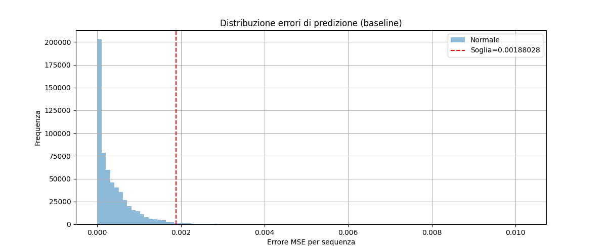
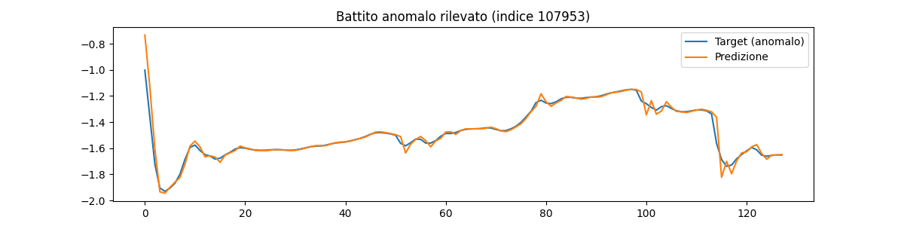
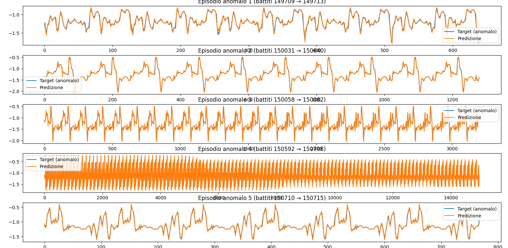

# ECG Sequence-to-Sequence Anomaly Detection


Rilevamento anomalie in segnali ECG a singolo canale usando un approccio **sequence-to-sequence regression**.  
Il modello predice il prossimo battito cardiaco dai precedenti; l’errore di predizione viene utilizzato per identificare battiti anomali.

---

## Dataset

- 25 volontari sani, segnali single-lead ECG
- Frequenza: 400 Hz
- Condizioni:
  - **Baseline (3 min)**: normal breathing, apnea, ipoventilazione
  - **Stress mentale (2 min)**
  - **Stress fisico (1 min)**

> Il modello viene addestrato solo sul **baseline**.

---

## Struttura progetto

- `data_loader.py`: carica CSV, organizza per persona/fase, genera sequenze input-target
- `preprocessing.py`: normalizza sequenze per LSTM
- `model.py`: definizione LSTM, training e predizione
- `evaluation.py`: calcolo errori, soglia di anomalie, filtro finestre, visualizzazione
- `main.py`: orchestratore completo, addestramento/modello caricato, valutazione e visualizzazione

---

## Installazione rapida

```bash
git clone https://github.com/ValerioMontanaro/ECG_Anomaly_Detection.git

cd ECG_Anomaly_Detection

python -m venv venv
# Windows
venv\Scripts\activate
# Linux/Mac
source venv/bin/activate
pip install -r requirements.txt

```

Assicurati di avere Tracciati_ECG.zip nella cartella content/.


## Esecuzione

```bash
python main.py
```

- Addestra il modello se non presente (ecg_model.h5)

- Calcola errori su dati normali e anomalie

- Determina soglia automatica (media + 3*std)

- Visualizza battiti anomali

- Identifica episodi consecutivi di anomalie (≥3 battiti)

## Risultati attesi (esempio)

- Threshold scelto automaticamente: 0.001880

- Numero battiti anomali rilevati: 53897

- Numero episodi anomali consecutivi rilevati: 2509

- Primi 5 episodi: [(149709, 149713), (150031, 150040), (150058, 150082), (150592, 150708), (150710, 150715)]

## Visualizzazione grafica
### Distribuzione errori

Istogramma degli errori di predizione su battiti normali (baseline)
La linea rossa indica la soglia scelta automaticamente.


### Battiti anomali rilevati

Confronto tra il battito reale (target) e la predizione del modello per alcuni battiti classificati come anomali.


### Episodi consecutivi

Grafico che evidenzia episodi di almeno 3 battiti consecutivi oltre la soglia, utile per applicazioni pratiche di monitoraggio continuo.


## Nota

- LSTM semplice per avere un errore naturale utile a stabilire il threshold

- Stress fisico e mentale trattati come anomalie

- Approccio sequence-to-sequence per catturare dinamiche temporali del battito

- Possibile configurazione pratica: considerare anomalia solo se 3 battiti consecutivi superano la soglia


